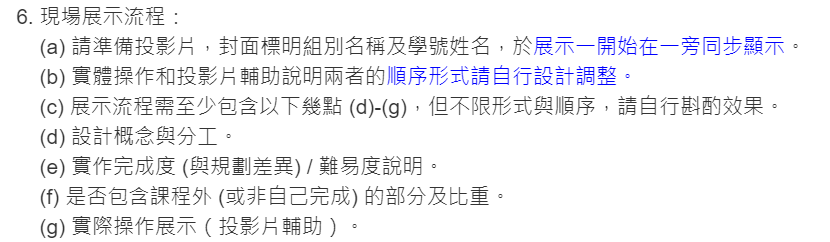

TODO
---

- [x] Hit judgment
- [x] Damage
- [x] Money (Score)
- [x] Playable with keyboard
- [x] Gamestart scene
- [x] Fail to exit
- [x] Fail scene
- [x] Level 1
- [x] Second Enemy
- [x] Coins -> Admission ticket
- [x] Level 2
- [x] Level 3
- [x] music
- [x] Level 4 ???

Debug
---
* 

Update
---
2024/1/8 10:30

**一些功能變更**
---

* 依難度總共分4關，可以分別從鍵盤按 1、2、3、? 進入關卡。
    * 第 1 關只有普通地鼠 (A)，而且同一時間最多出現一隻地鼠。
    * 第 2 關新增特殊地鼠 (B)，如果打了反而會扣血，同一時間可能出現兩隻地鼠（A+B）。
    * 第 3 關可能出現 A+A 或 A+B 的組合。
    * 第 ? 關心曾特殊地鼠 (C)，出現後會短暫隱身再出現，隱身其間無法擊中，同一時間可能出現三隻地鼠 (A+B+C)，但不會出現 A+A。
    * 所有地鼠只要擊中就會立刻消失。
    * 可以考慮貼一下關卡設計相關的截圖。

* 金錢系統變成入場卷使用，取消商店。
    * 一開始會有 20 元。
    * 進入任意關卡需要花費 10 元當作入場卷。
    * 擊中地鼠 A 能 +1。
    * 如果挑戰失敗會再額外扣 10 元。
    * 如果錢不足以進入關卡 (<10)，無法進入關卡，即強迫 reset。

* 作弊模式
    * 不會扣血，金錢設定為 99，取消後金錢維持 99。
    * 建議在第 ? 關展示，因為那關本來就是觀賞用關卡。
    * 有一個很神奇的 bug，如果作弊模式下一隻都沒打到的話關卡會跳不出去。

**檔案分類**
---

VGA 相關
* `background.v`
* `composite.v`
* `enemy_0.v`
* `enemy_1.v`
* `enemy_2.v`
* `enemy_pos.v`
* `failure.v`
* `gamestart.v`
* `vga.v`

音樂相關
* `beat.v`
* `music_sheet.v`
* `music.v`
* `note_gen.v`
* `speaker_control.v`

關卡設計相關
* `script.v`
* `script_gen.cpp`

遊玩系統相關
* `gamestart.v`
* `hit_judge.v`
* `Keyboard_Decoder.v`
* `player.v`
* `SevenSegment.v`
* `top.v` (FSM)

> 傷害判定在 `enemy_{}.v`